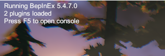
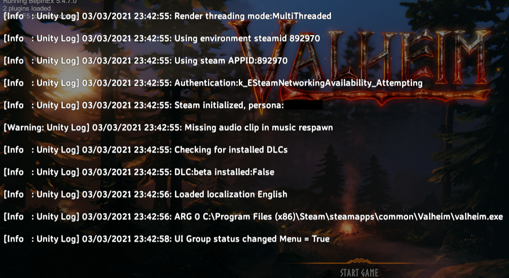
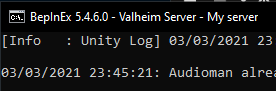

# Display BepInEx Info

This helper plugin displays better BepInEx information in Valheim.

## Features

### BepInEx version and number of loaded plugins in main menu

Shows BepInEx info in top left corner of game main menu:  

### Prints BepInEx logs into game console

Shows BepInEx logs and errors in game console:  

### Shows server name in console title

Shows Valheim server name in BepInEx console title when running a dedicated server:  

## Installation

Download the plugin DLL from releases and put into `BepInEx/plugins`.